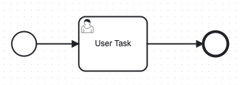
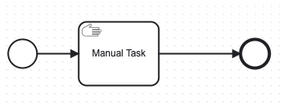
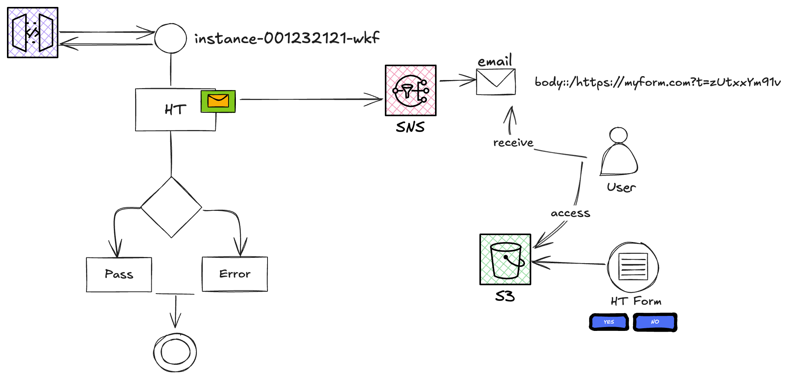

= Step Function Mocking Camunda Features

IMPORTANT: Step Functions are primarily used for orchestrating AWS services and defining workflows using Amazon's ecosystem.

== Send Task

image::./thumbs/camunda/SendTask.png[, role=left]

*Yes*, AWS Step Functions have built-in Service task capability, but they have differences, including their ability to send tasks or integrate with external systems

'''

=== Camunda's Send Task

The Send Task in Camunda is a type of BPMN (Business Process Model and Notation) task used to send a message to an external system or service during a workflow

. *Purpose*

- Used to send messages to external systems or applications without waiting for a response. It's essentially a fire-and-forget mechanism.

. *Message Communication*

- Sends a specific message to a pre-defined recipient, such as an external service, through mechanisms like _REST, SOAP, or message queues._

=== AWS Step Functions Equivalent

1. *Via AWS Lambda*:

- Use Lambda functions as tasks in your Step Functions workflow.
- Inside the Lambda function, make an HTTP request to Camunda's REST API to send or manage tasks.

2. *Custom Activity Worker*:

- If your Camunda setup requires a custom worker pattern, you could use Step Functions to trigger a worker that communicates with Camunda.

3. *Event Bridge or SQS*:

- Step Functions can trigger events via AWS EventBridge or send messages to an SQS queue.

- Camunda could then consume these events/messages through a listener or custom application.

== Receive Task

image::./thumbs/camunda/ReceiveTask.png[, role=left]

*No*, AWS Step Functions #*does not have a direct equivalent of the "Receive Task" capability in Camunda BPMN*#. However, you can achieve similar functionality in Step Functions using a combination of its features.

'''

=== Camunda's Receive Task

- *In Camunda*, a *Receive Task* is a BPMN element that waits for an external event or message to proceed. It is commonly used in workflows where an external system needs to signal the process to move forward.

=== AWS Step Functions Equivalent

. *Task with Callback Pattern*: You can define a task in Step Functions that waits for an external system to send a TaskToken back to the Step Functions workflow. This is achieved using *Amazon SNS, SQS, or a custom integration.*

. *Wait State with Polling*: Use a Wait State to delay for a set duration, followed by a task that polls an external system or database for the required event or signal. *_(Thread Sleep Java)_*

== User Task

*No*, AWS Step Functions #*does not natively support user tasks*# in the same way as Camunda or another Business Process Model and Notation (BPMN)-compliant platforms.

Possible Workarounds: State Machine Signals, Wait or Task, SWF Integration with limitations,

State Machine on Step Function side can be implemented by poll for external signals (e.g., DynamoDB, S3, or API Gateway) that a user has completed a task.

'''

=== Camunda User Task Capability

- *User Tasks*: Camunda includes a concept of "user tasks" where tasks are explicitly assigned to a person or group of people. These tasks appear in a task list or workbench where users can claim, execute, and complete them manually.

- *BPMN Compliance*: Camunda provides a full BPMN implementation, allowing complex workflows involving human interaction, decision-making, and system processes.

=== AWS Step Functions Equivalent

- *No Native User Task Concept*: Step Functions focuses on orchestrating serverless workflows and does not have built-in user task management features. It's designed for system-to-system interactions rather than human workflow management.

- *Integration with Other Services*: To mimic user task functionality in Step Functions, you can integrate with other services:
.. Amazon SQS/SNS: Send a notification to a queue or topic for a user to process.

.. Amazon EventBridge: Route events to services that involve users, like Lambda functions triggering notifications.

.. External User Management: Use external systems, such as a custom UI, to handle user tasks and send status updates back to Step Functions.

== Manual Task

*No*, AWS Step Functions #*does not have a direct equivalent of Camunda's Manual Task capability*#, but it can achieve similar functionality through creative use of its state machine design.

'''

=== Camunda Manual Task Capability

A Manual Task in Camunda represents work that must be done manually, without system involvement. It is essentially a placeholder in the workflow that waits for human interaction or external confirmation.

=== Step Function Manual Task Equivalent

. *Wait State*

- Use the Wait state to pause execution for a specific duration while waiting for an external event.

- This is static and time-bound, so it's suitable only if you know the maximum expected time for the manual task.

. *Callback with Task Token*:

- Use an `Activity` or a `Callback Pattern` with a Task Token.

- The workflow execution is paused at the task state until an external system (or a human) completes the task and sends a `SendTaskSuccess` or `SendTaskFailure` signal using the Task Token.

- This is the closest equivalent to a manual task in Step Functions, as it allows indefinite waiting and dynamic resumption.

. *Integration with External Systems*:

- Use AWS services like Amazon SQS, Amazon SNS, or Amazon EventBridge to notify humans or systems about the task.

- Once the manual task is completed, the external system can invoke the Step Functions API to continue the workflow.

==== Custom UI for Human Intervention

- *Human Task Handling*: AWS Step Functions does not have direct support for human task management or custom forms, and to overcome this limitation, we can use SNS notify humans or trigger external workflows, based on Emails, or AWS Amazon Mechanical Turk, AWS Lambda, or even custom APIs can handle human input tasks, *but you need to build the form UI externally*;

On one hand, Camunda is designed as a BPM platform tailored for complex workflows, supporting both automated and human tasks, along with custom forms that integrate seamlessly for user input, making it a more cohesive choice for human-centric workflows. On the other hand, Step Functions can achieve similar features with additional development efforts

We can think as below presented, in *_custom fronted_*, based on Web (S3, EC2) or Mobile Apps, or using Task Tokens to allow them to wait for external human input before proceeding.

- Static HTML/JS from S3 can also be considered to decouple forms when complex submission is required, but we take some considerations into account, such as a remote hosting bucket with a link.

Having this in mind, we can conclude that; *Yes*, it is possible to use custom forms with human tasks in AWS Step Functions, but it requires integration with additional services because AWS Step Functions itself does not natively provide a user interface for human tasks.

We can store form templates in *Amazon S3* which is responsible for fetch form data in HTML mode, wait for *Lambda or API GTW responses*, and after an HT is paused, we can *_Resume the Execution_* once response is received

== Service Task

image::./thumbs/camunda/ServiceTask.png[, role=left]

*No*, AWS Step Functions does not have a direct "Service Task" concept, but offers somewhat similar capability, but they #*differ significantly in terms of design and features*#.

Service Task in Camunda take the full benefits and capabilities from Java Spring SDK, for example, to make a S3 API we can use https://spring.io/projects/spring-cloud-aws[Spring Cloud AWS]

==== Camunda's Service Task

In Camunda, a Service Task is a BPMN construct used to execute automated business logic. It typically invokes external services or APIs, which can be implemented using Java, REST, or other integrations. Camunda provides features like:

. Synchronous and asynchronous execution of tasks.
. Full BPMN 2.0 support, including error handling and compensation mechanisms.
. Complex workflows with advanced logic like gateways, timers, and event handling.
. Integration with external services and systems through connectors or custom code.

==== AWS Step Functions Equivalent

*Key features include*

- *Task States* allow you to call AWS services (via Service Integrations) or invoke Lambda functions, containers, or APIs.

- *Service Integrations*: Native integrations with AWS services like DynamoDB, S3, SageMaker, and others without needing custom code.

- *Custom Task Implementations*: For non-AWS services, you can use Lambda functions, or call external APIs using the HTTP integration.

- *JSON-based state machine definitions* (Amazon States Language) for modeling workflows, using *_JSON Path Expression_* capability

image::./thumbs/stepfunction/step-functions-example.png[,]

- Built-in error handling, retries, and timeouts for tasks, here we have an https://camel.apache.org/manual/error-handler.html[_Apache Camel_ error handler] similar capability

image::./thumbs/stepfunction/custom-error-handling-sm.png[,]

[%header,cols=3*]
|===
|Feature
|AWS Step Functions
|Camunda Service Task

|*Ease of Use*
|Simplified with native AWS integrations
|Requires more setup for integrations

|*Execution Type*
|Lambda, AWS services, or external APIs
|Java, REST, or custom implementations

|*Error Handling*
|Built-in with retries and catch blocks
|BPMN 2.0 constructs for error events

|*State Modeling*
|JSON-based state machine
|BPMN 2.0 graphical models

|*Cloud-Native*
|Yes (managed AWS service)
|Requires deployment and management

|===

== Exclusive Gateway

image::./thumbs/camunda/ExclusiveGateway.png[,role=left]

*Yes*, AWS Step Functions #*have an equivalent to the Exclusive Gateway*# capability found in Camunda's BPMN modeling. However, it provides functionality #*to achieve similar outcomes through its Choice state.*#

IMPORTANT: AWS Step Function uses https://docs.aws.amazon.com/step-functions/latest/dg/concepts-amazon-states-language.html[Amazon States Language], its own language expression capability

[source, json]
----
{
  "Comment": "An example of the Amazon States Language using a choice state.",
  "QueryLanguage": "JSONata",
  "StartAt": "FirstState",
  "States": {
    "FirstState": {
      "Type": "Task",
      "Assign": {
        "foo" : ""
        },
      "Resource": "arn:aws:lambda:us-east-1:123456789012:function:FUNCTION_NAME",
      "Next": "ChoiceState"
    },
    "ChoiceState": {
      "Type": "Choice",
      "Default": "DefaultState",
      "Choices": [
        {
          "Next": "FirstMatchState",
          "Condition": ""
        },
        {
          "Next": "SecondMatchState",
          "Condition": ""
        }
      ]
    },
    "FirstMatchState": {
      "Type" : "Task",
      "Resource": "arn:aws:lambda:us-east-1:123456789012:function:OnFirstMatch",
      "Next": "NextState"
    },

    "SecondMatchState": {
      "Type" : "Task",
      "Resource": "arn:aws:lambda:us-east-1:123456789012:function:OnSecondMatch",
      "Next": "NextState"
    },

    "DefaultState": {
      "Type": "Fail",
      "Error": "DefaultStateError",
      "Cause": "No Matches!"
    },

    "NextState": {
      "Type": "Task",
      "Resource": "arn:aws:lambda:us-east-1:123456789012:function:FUNCTION_NAME",
      "End": true
    }
  }
}
----

==== Camunda Exclusive Gateway

In BPMN, the Exclusive Gateway allows for conditional branching. It evaluates the defined conditions and directs the process flow along the first sequence flow that meets the condition

==== AWS Step Functions Equivalent

The Choice state in AWS Step Functions serves a similar purpose based on _JSON-Path Expression_

- It evaluates conditions and directs the workflow to the next state based on those conditions.

- Each condition is evaluated in order, and the workflow follows the first matching branch.

- If no conditions match, you can define a Default state to handle unanticipated scenarios.

== Cockpit Dashboard

IMPORTANT: *NO, AWS Step Functions does not have the same cockpit capability as Camunda. They have distinct capabilities and are designed for different use cases*

But we have some similar features, let's compare:

==== Camunda's Cockpit

* Purpose: Camunda Cockpit is a graphical monitoring and management tool for workflows and processes.

===== Features:

* *Visual Representation*: Provides a detailed, real-time visualization of running workflows, including their current state, variables, and any errors.

image::./thumbs/icons/star.png[20, 20, role=left]
_This is an equivalent Step Function Feature but with limited_

- *Management Tools*: Allows for manual intervention in workflows, such as retrying, skipping, or canceling tasks. Here Step Functions have similar features but with limitations.

_Step Function doesn't natively provide the same task Management Tools Capabilities_

- *Audit Trail*: Keeps a detailed history of process execution for debugging and optimization.

image::./thumbs/icons/star.png[20, 20, role=left]
_This is an equivalent Step Function Feature_

- Process Instance Inspection: Drill down into a single process instance to inspect variables and state transitions.

image::./thumbs/icons/star.png[20, 20, role=left]
_This is an equivalent Step Function Feature_

- *User-Friendly UI*: A robust web interface designed for business users and developers to interact with processes.

_Step Function doesn't provide User-Friendly UI to Business users, it's Limited to AWS Console for insights—there isn’t a sophisticated dashboard like Camunda Cockpit._

==== AWS Step Functions Equivalent

* *Purpose*: A cloud-native workflow orchestration service for building distributed applications.

===== Features:

- *Visual Workflow Designer*: Provides a graphical interface to design workflows, but it is not as detailed as Camunda Cockpit, so can offer retry and error handling mechanisms, but doesn’t have a central UI for managing workflows beyond execution monitoring, without customizations or external plugins for additional UI Capabilities

image::./thumbs/icons/star.png[20, 20, role=left]
_Camunda has equivalent Feature with improvements_

- *State Machine Execution History*: You can view execution history, including details of each state transition and any errors, through the AWS Management Console.

image::./thumbs/icons/star.png[20, 20, role=left]
_Camunda has equivalent Feature with improvements_

- *Cloud Integration*: Tight integration with AWS services, enabling workflows to call other AWS services directly.

_Camunda doesn't natively provide easy Cloud Integrationm, using low code such as Step Function_

- *Limited Manual Control*: While you can restart or stop workflows, there is less emphasis on fine-grained manual intervention compared to Camunda.

image::./thumbs/icons/star.png[20, 20, role=left]
_Camunda has equivalent Feature with improvements_

- *Real-Time Monitoring*: Provides metrics and logs, but does not offer a detailed cockpit-like visualization for process instances.

image::./thumbs/icons/star.png[20, 20, role=left]
_Camunda has equivalent Feature with improvements_

- *Designed primarily for*: developers want building serverless workflows, with Native event-based and highly scalable.

== Step Function Versioning

Step Function doesn't have built-in version management in the way that you might version Lambda functions or other AWS resources directly, but can achieve versioning and manage changes in your Step Functions workflows using some strategies:

* *Separate Workflows for Versions*

- Create multiple Step Function workflows, each representing a version. For example:
----
.  MyWorkflow_v1
.  MyWorkflow_v2
----

* *Aliases and Configuration Management*

- Use a configuration management system (e.g., AWS Parameter Store or Secrets Manager) to point to the current "active" version of the workflow. This way, clients or services can query the latest version dynamically.

- Use Lambda aliases or ARNs in the tasks of your Step Function to point to specific versions of the Lambda functions being used.

== Link Intermediate Throw Event

*No*, AWS Step Functions does not have a direct equivalent to the "Link Intermediate Throw Event" found in Camunda

==== Camunda's Feature

*No*, Step Functions don't have a similar feature, Step Function was designed for orchestrating distributed (AWS) applications and does not support BPMN-style elements, to achieve this using the Step function we need to spend more effort

LINK Intermediate Throw Event is used to connect different parts of a process model without creating a physical sequence flow between them, often for readability or modularity purposes in large workflows.

==== AWS Step Functions Equivalent

* *Feature*:

* *Using States to Modularize Workflow*

- You can break a large Step Functions workflow into smaller, modular workflows and invoke them using the `StartExecution API` (via a Task state).

- This is analogous to linking workflows indirectly; we can use the same idea to express reusability, but using other Cloud Resources such as Lambda, EventBridge

== Link Intermediate Catch Event

*No*, AWS Step Functions does not have a direct equivalent to the "Link Intermediate Catch Event" found in Camunda

==== Camunda's Feature

- This Camunda's construction is used to model a "logical jump" within a process flow, enabling you to connect different parts of the process without requiring explicit transitions between them.

- It simplifies complex diagrams by allowing reusable and modular connections between process elements.

==== AWS Step Functions Equivalent

* *Choice States*:

- *Step Functions` Choice*: state allows you to define conditional paths based on input data. While not a direct jump, it enables dynamic routing within a workflow.

- *Task States with Lambda Functions*: You can use AWS Lambda functions to implement reusable logic or decide dynamically which state to transition to next.

- *Nested Workflows*: You can invoke nested workflows (Step Functions within Step Functions) to modularize and reuse logic across workflows.

- *Error Handling with Catch and Retry*: The Catch field in Step Functions provides error-handling capabilities. Although this is primarily for exception handling, it can also redirect execution flow when specific errors occur.

- *Dynamic Input and Output Passing*: Step Functions can pass data dynamically between states, allowing you to emulate flexible transitions by configuring the Next field programmatically.

.Brief Comparison
[%header,cols=3*]
|===
|Feature
|Camunda (BPMN)
|Step Function

|Link Intermediate Catch Event
|Yes
|No (can be emulated dynamically)

|Conditional Routing
|Yes (via Gateways)
|Yes (via Choice states)

|Modularity and Reusability
|Yes (via Call Activities)
|Yes (via Nested Workflows)

|Error Handling and Compensation
|Yes
|Yes

|===

== Timer Boundary Event (NoN Interrupting)

*No*, AWS Step Functions does not have an out-of-the-box equivalent to Timer Boundary Events from Camunda, but we can achieve similar functionality using a combination of Step Functions features and AWS services.

==== Camunda's Feature

Timer Boundary Event is attached to a task and *triggers after a specific time without interrupting the main process flow*. The process continues to execute the primary task while the timer triggers an additional flow, based in this trigger decision or tasks will be assumed, taking the flow in a different flow.

==== AWS Step Functions Equivalent

We can achieve this in SF, using similar concepts

* *Parallel State*:

- *Use a Parallel state* to simulate concurrent execution.

- *Dynamic Wait State* with `Wait` state with the `Timestamp` field.

- *Compute the wait time dynamically* before triggering the state machine.

- *Event-Driven Timer*: Using EventBridge for asynchronous timer events.

==== Limitations

- *No direct attachment to a task*: Unlike Camunda, where timers are visually and semantically bound to a specific task, AWS Step Functions requires manual design of parallel flows.

- *Complexity*: Simulating Camunda's non-interrupting boundary timer increases the complexity of the workflow definition.
