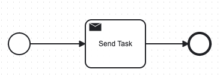
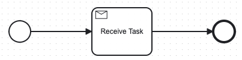
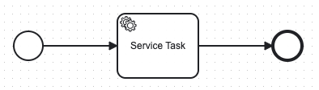
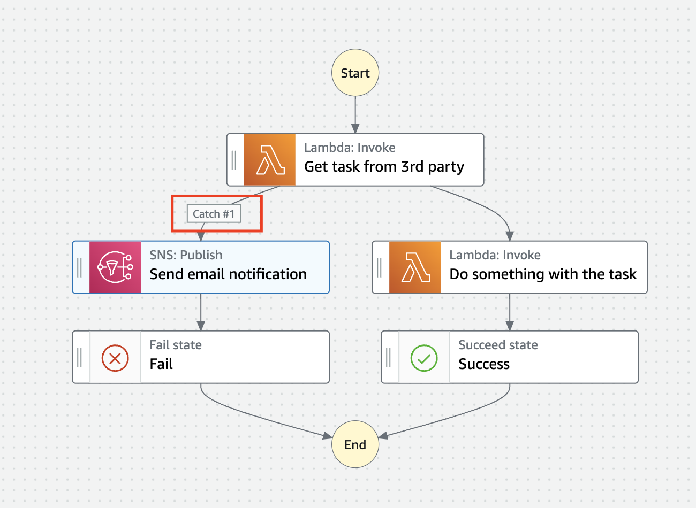
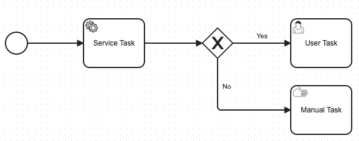

= Step Function Mocking Camunda Features

IMPORTANT: Step Functions are primarily used for orchestrating AWS services and defining workflows using Amazon's ecosystem.

== Send Task

AWS Step Functions have built-in Service task capability, but they have differences, including their ability to send tasks or integrate with external systems

==== Camunda's Send Task

The Send Task in Camunda is a type of BPMN (Business Process Model and Notation) task used to send a message to an external system or service during a workflow

. *Purpose*

- Used to send messages to external systems or applications without waiting for a response. It's essentially a fire-and-forget mechanism.

. *Message Communication*

- Sends a specific message to a pre-defined recipient, such as an external service, through mechanisms like _REST, SOAP, or message queues._

==== AWS Step Functions: Equivalent Mechanisms

1. *Via AWS Lambda*:

- Use Lambda functions as tasks in your Step Functions workflow.
- Inside the Lambda function, make an HTTP request to Camunda's REST API to send or manage tasks.

2. *Custom Activity Worker*:

- If your Camunda setup requires a custom worker pattern, you could use Step Functions to trigger a worker that communicates with Camunda.

3. *Event Bridge or SQS*:

- Step Functions can trigger events via AWS EventBridge or send messages to an SQS queue.

- Camunda could then consume these events/messages through a listener or custom application.

== Receive Task

AWS Step Functions #*does not have a direct equivalent of the "Receive Task" capability in Camunda BPMN*#. However, you can achieve similar functionality in Step Functions using a combination of its features.

==== Camunda's Receive Task

- *In Camunda*, a *Receive Task* is a BPMN element that waits for an external event or message to proceed. It is commonly used in workflows where an external system needs to signal the process to move forward.

==== AWS Step Functions: Equivalent Mechanisms

. *Task with Callback Pattern*: You can define a task in Step Functions that waits for an external system to send a TaskToken back to the Step Functions workflow. This is achieved using *Amazon SNS, SQS, or a custom integration.*

. *Wait State with Polling*: Use a Wait State to delay for a set duration, followed by a task that polls an external system or database for the required event or signal. *_(Thread Sleep Java)_*

== Service Task

AWS Step Functions does not have a direct "Service Task" concept, but offers somewhat similar capability, but they #*differ significantly in terms of design and features*#.

Service Task in Camunda take the full benefits and capabilities from Java Spring SDK, for example, to make a S3 API we can use https://spring.io/projects/spring-cloud-aws[Spring Cloud AWS]

==== Camunda's Service Task

In Camunda, a Service Task is a BPMN construct used to execute automated business logic. It typically invokes external services or APIs, which can be implemented using Java, REST, or other integrations. Camunda provides features like:

. Synchronous and asynchronous execution of tasks.
. Full BPMN 2.0 support, including error handling and compensation mechanisms.
. Complex workflows with advanced logic like gateways, timers, and event handling.
. Integration with external services and systems through connectors or custom code.

==== AWS Step Functions Equivalent

*Key features include*

- *Task States* allow you to call AWS services (via Service Integrations) or invoke Lambda functions, containers, or APIs.

- *Service Integrations*: Native integrations with AWS services like DynamoDB, S3, SageMaker, and others without needing custom code.

- *Custom Task Implementations*: For non-AWS services, you can use Lambda functions, or call external APIs using the HTTP integration.

- *JSON-based state machine definitions* (Amazon States Language) for modeling workflows, using *_JSON Path Expression_* capability

image::./thumbs/stepfunction/step-functions-example.png[,]

- Built-in error handling, retries, and timeouts for tasks, here we have an https://camel.apache.org/manual/error-handler.html[_Apache Camel_ error handler] similar capability

[%header,cols=3*]
|===
|Feature
|AWS Step Functions
|Camunda Service Task

|*Ease of Use*
|Simplified with native AWS integrations
|Requires more setup for integrations

|*Execution Type*
|Lambda, AWS services, or external APIs
|Java, REST, or custom implementations

|*Error Handling*
|Built-in with retries and catch blocks
|BPMN 2.0 constructs for error events

|*State Modeling*
|JSON-based state machine
|BPMN 2.0 graphical models

|*Cloud-Native*
|Yes (managed AWS service)
|Requires deployment and management

|===

== Exclusive Gateway

AWS Step Functions #*does not have a direct equivalent to the Exclusive Gateway*# capability found in Camunda's BPMN modeling. However, it provides functionality #*to achieve similar outcomes through its Choice state.*#

IMPORTANT: AWS Step Function uses https://docs.aws.amazon.com/step-functions/latest/dg/concepts-amazon-states-language.html[Amazon States Language], its own language expression capability

[source, json]
----
{
  "Comment": "An example of the Amazon States Language using a choice state.",
  "QueryLanguage": "JSONata",
  "StartAt": "FirstState",
  "States": {
    "FirstState": {
      "Type": "Task",
      "Assign": {
        "foo" : ""
        },
      "Resource": "arn:aws:lambda:us-east-1:123456789012:function:FUNCTION_NAME",
      "Next": "ChoiceState"
    },
    "ChoiceState": {
      "Type": "Choice",
      "Default": "DefaultState",
      "Choices": [
        {
          "Next": "FirstMatchState",
          "Condition": ""
        },
        {
          "Next": "SecondMatchState",
          "Condition": ""
        }
      ]
    },
    "FirstMatchState": {
      "Type" : "Task",
      "Resource": "arn:aws:lambda:us-east-1:123456789012:function:OnFirstMatch",
      "Next": "NextState"
    },

    "SecondMatchState": {
      "Type" : "Task",
      "Resource": "arn:aws:lambda:us-east-1:123456789012:function:OnSecondMatch",
      "Next": "NextState"
    },

    "DefaultState": {
      "Type": "Fail",
      "Error": "DefaultStateError",
      "Cause": "No Matches!"
    },

    "NextState": {
      "Type": "Task",
      "Resource": "arn:aws:lambda:us-east-1:123456789012:function:FUNCTION_NAME",
      "End": true
    }
  }
}
----

==== Camunda Exclusive Gateway

In BPMN, the Exclusive Gateway allows for conditional branching. It evaluates the defined conditions and directs the process flow along the first sequence flow that meets the condition

==== AWS Step Functions Choice State

The Choice state in AWS Step Functions serves a similar purpose based on _JSON-Path Expression_

- It evaluates conditions and directs the workflow to the next state based on those conditions.

- Each condition is evaluated in order, and the workflow follows the first matching branch.

- If no conditions match, you can define a Default state to handle unanticipated scenarios.